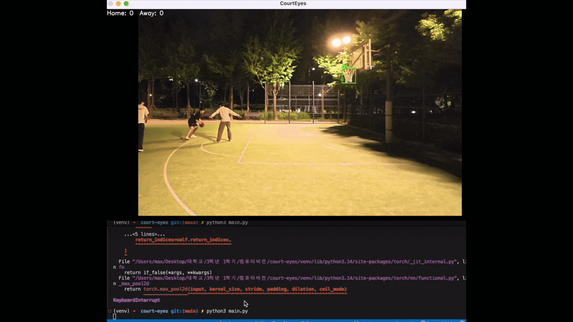

# CourtEyes 🏀

> Real-time basketball goal detection system using YOLOv8 and Python


---

## 프로젝트 배경

동아리에서 직접 농구를 할 때 점수, 샷클락을 사람이 관리해야 한다. 프로 경기에서도 예외가 아니다. 귀찮기도 하고 사람은 실수할 수도 있다. 반응도 컴퓨터보다 보통 느리기 때문에 결정적인 순간엔 영향이 클 수 있다. 컴퓨터 비전으로 처리해서 좀 더 편하고 정확하게 할 수 있지 않을까? 하는 생각에서 시작하게 되었다.

---

## 프로젝트 소개

농구 경기에서 골인, 리바운드, 파울, 타임아웃, 볼 아웃 등 다양한 상황이 발생할 때마다 득점 반영, 샷클락 리셋, 메인클락 조정을 아직까지 사람이 직접 수동으로 처리하고 있다.

**CourtEyes**는 컴퓨터 비전을 활용해 이 과정을 자동화하는 시스템이다. 카메라로 경기 상황을 실시간으로 분석하여 공의 움직임과 골인 여부를 판정하고, 득점을 자동으로 반영한다.

---

## 주요 기능 (목표)

- **골인 판정 (림 통과 여부)** — 공이 골대를 통과하는 순간을 자동 감지하여 득점 반영
- **리바운드 vs 골인 구분** — 구분하여 샷클락까지 설정
- **샷클락 자동 관리** — 공을 잡거나 던지는 순간을 인식하여 샷클락 자동 리셋
- **메인클락 관리** — 경기 상황(볼 아웃, 파울 등)에 따라 클락 자동 조정
- **실시간 점수판** — 득점을 실시간으로 화면에 표시
- **2점 / 3점 자동 구분** — 3점 라인 기준으로 자동 구분

---

## 구현된 기능

- YOLOv8 기반 농구공 및 림 실시간 탐지
- 공의 궤적 분석을 통한 골인 판정 알고리즘
- 쿨다운 로직으로 중복 판정 방지
- 직접 촬영한 영상 데이터로 fine-tuning

---
## 골이 들어가면 왼쪽 상단에 Home 점수가 올라갑니다! 
## 골인 판정 로직

카메라로 매 프레임마다 공과 림의 위치를 탐지하고, 아래 두 조건을 동시에 만족할 때 골인으로 판정한다.


**조건 1 - X축 조건 (공이 림 너비 안에 있는가)**
```python
abs(ball_x - rim_x) < rim_width
```

**조건 2 - Y축 조건 (공이 위에서 아래로 통과했는가)**
```python
이전 프레임 공 y좌표 < 림 y좌표
현재 프레임 공 y좌표 > 림 y좌표
```
> **한계**: 공이 림 바로 위에서 탐지되지 않으면 이전 y좌표가 오염되어 판정에 실패할 수 있다.
## 결과 분석

### ✅ 골인 정상 판정 (Real Goals)
- 기본 슛 


- 레이업

### ✅ 노골 정상 판정 (Real Not Goals)


### ❌ 미판정 케이스 (Bad Goals - 골인이지만 판정 실패)


> 공이 림 바로 위에서 탐지되지 않아 판정 실패 -> 림을 통과하기 적전에 볼이 인식이 되어야함

### ❌ 오판정 케이스 (Bad Not Goals - 노골이지만 골 판정)


> 공이 림 위에서 튕겨 나갔는데 2차원에서 볼때 림아래로 수직으로 떨어졌다면 골인으로 판정

---

## 한계 및 개선 방향

- 단일 카메라 고정 환경에서만 동작 (카메라 이동 시 판정 불안정)
- 공이 빠르게 움직이거나 가려질 경우 탐지 누락 발생
- 추후 다중 카메라 또는 더 많은 데이터로 fine-tuning 시 개선 가능
- 2차원으로 밖에 보지못해서 에어볼이나 들어가지 못한 공이 골로 판정될 수도 있다.
## 현실적인 문제점 및 보완할 점
- 실제 중계화면으로 테스트해본 결과에 대하여: 맨 위에 있는 대표 Gif에서도 보았듯이 일단 농구공이 여러개 있을 때 문제이다. 실제 경기 영상에서 공이 여러개 잡힐 수 있다. (벤치에서 선수들이 만지는 공들)
- 공이 가만히 있을 때는 괜찮지만 날아갈 때 완전한 공의 이미지를 담지 못하거나 결정적인 순간에 즉 림 바로 위에서 무언가에 의해 공이 모습이 가려지거나 희미해진다면 인식을 못한다.
- 혼란스러운 경기장: 실제 경기장은 관중들, 선수들, 여러가지 장비 및 용품들에 의해서 일단 시각적으로 인식하기 좋은 환경이 아니다.
- 골대를 위에서도 찍고 옆에서도 찍어서 확실하게 판정하면 정확도가 높아지겠지만 너무 많은 예외 상황을 커버하려면 아직 사람을 따라갈 수 있을지 의문이다.

## 결론
골 판정만으로도 쉽지 않은데 리바운드, 파울 등 여러가지 상황을 보기엔 아직 힘들다는 걸 이번에 직접 구현해보면서 느꼈다. 아직 사람이 하는 이유가 있다!
---

## 기술 스택

| 분류      | 기술                            |
| --------- | ------------------------------- |
| Language  | Python                          |
| Detection | YOLOv8 (Ultralytics)            |
| Tracking  | ByteTrack                       |
| Camera    | OpenCV                          |
| Dataset   | Roboflow (Basketball Detection) |

---

## 실행 방법

```bash
# 가상환경 활성화
source venv/bin/activate

# 의존성 설치
pip install ultralytics opencv-python

# 실행 (영상 파일명 수정 필요)
python3 main.py
```

---

## 참고자료

- [YOLOv8 - Ultralytics](https://github.com/ultralytics/ultralytics)
- [Basketball Detection Dataset - Roboflow Universe](https://universe.roboflow.com/cricket-qnb5l/basketball-xil7x)
- [OpenCV](https://opencv.org/)
