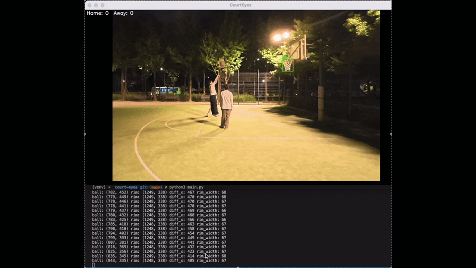
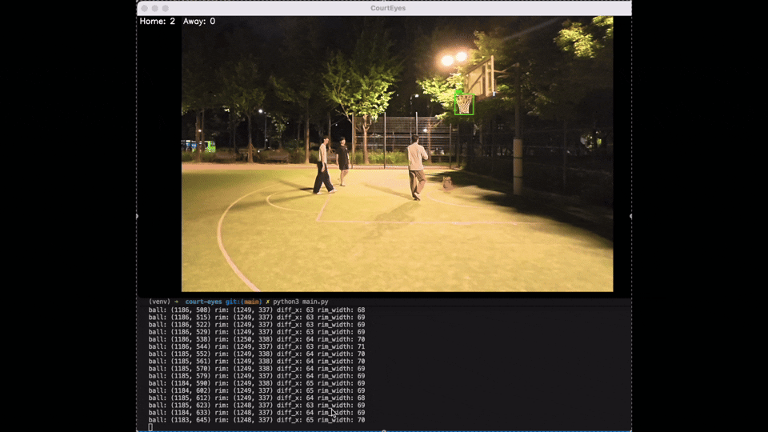
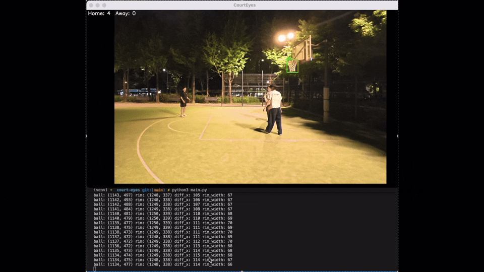
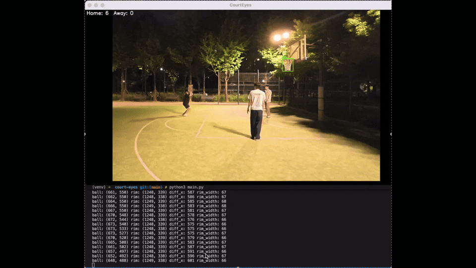
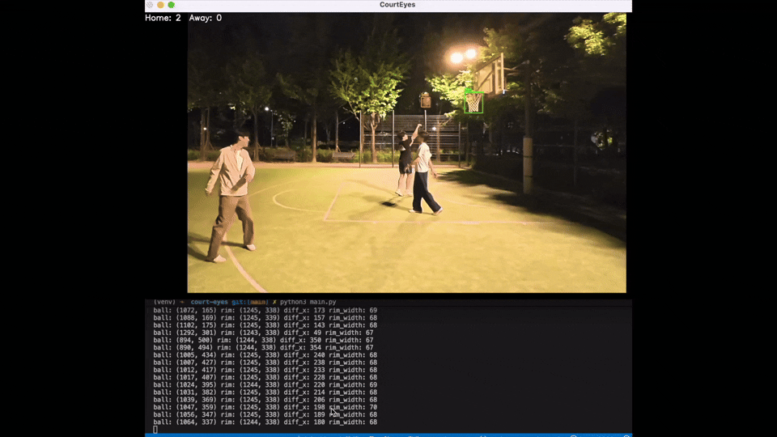

# CourtEyes 🏀

> Real-time basketball goal detection system using YOLOv8 and Python


---

## 프로젝트 배경

동아리에서 직접 농구를 할 때 점수, 샷클락을 사람이 관리해야 한다. 프로 경기에서도 예외가 아니다. 귀찮기도 하고 사람은 실수할 수도 있다. 반응도 컴퓨터보다 보통 느리기 때문에 결정적인 순간엔 영향이 클 수 있다. 컴퓨터 비전으로 처리해서 좀 더 편하고 정확하게 할 수 있지 않을까? 하는 생각에서 시작하게 되었다.

---

## 프로젝트 소개

농구 경기에서 골인, 리바운드, 파울, 타임아웃, 볼 아웃 등 다양한 상황이 발생할 때마다 득점 반영, 샷클락 리셋, 메인클락 조정을 아직까지 사람이 직접 수동으로 처리하고 있다.

**CourtEyes**는 컴퓨터 비전을 활용해 이 과정을 자동화하는 시스템이다. 카메라로 경기 상황을 실시간으로 분석하여 공의 움직임과 골인 여부를 판정하고, 득점을 자동으로 반영한다.

---

## 주요 기능 (목표)

- **골인 판정 (림 통과 여부)** — 공이 골대를 통과하는 순간을 자동 감지하여 득점 반영
- **리바운드 vs 골인 구분** — 구분하여 샷클락까지 설정
- **샷클락 자동 관리** — 공을 잡거나 던지는 순간을 인식하여 샷클락 자동 리셋
- **메인클락 관리** — 경기 상황(볼 아웃, 파울 등)에 따라 클락 자동 조정
- **실시간 점수판** — 득점을 실시간으로 화면에 표시
- **2점 / 3점 자동 구분** — 3점 라인 기준으로 자동 구분

---

## 구현된 기능

- YOLOv8 기반 농구공 및 림 실시간 탐지
- 공의 궤적 분석을 통한 골인 판정 알고리즘
- 쿨다운 로직으로 중복 판정 방지
- 직접 촬영한 영상 데이터로 fine-tuning

---

## 결과 분석

### ✅ 골인 정상 판정 (Real Goals)

|                           |                           |                           |
| ------------------------- | ------------------------- | ------------------------- |
|  |  |  |
|  |                           |                           |

### ✅ 노골 정상 판정 (Real Not Goals)


### ❌ 미판정 케이스 (Bad Goals - 골인이지만 판정 실패)



> 공이 림 바로 위에서 탐지되지 않아 이전 y좌표가 오염되어 판정 실패

### ❌ 오판정 케이스 (Bad Not Goals - 노골이지만 골 판정)



> 공이 림 근처에서 튀길 때 조건을 만족하여 오판정 발생

---

## 한계 및 개선 방향

- 단일 카메라 고정 환경에서만 동작 (카메라 이동 시 판정 불안정)
- 공이 빠르게 움직이거나 가려질 경우 탐지 누락 발생
- 추후 다중 카메라 또는 더 많은 데이터로 fine-tuning 시 개선 가능

---

## 기술 스택

| 분류      | 기술                            |
| --------- | ------------------------------- |
| Language  | Python                          |
| Detection | YOLOv8 (Ultralytics)            |
| Tracking  | ByteTrack                       |
| Camera    | OpenCV                          |
| Dataset   | Roboflow (Basketball Detection) |

---

## 실행 방법

```bash
# 가상환경 활성화
source venv/bin/activate

# 의존성 설치
pip install ultralytics opencv-python

# 실행 (영상 파일명 수정 필요)
python3 main.py
```

---

## 참고자료

- [YOLOv8 - Ultralytics](https://github.com/ultralytics/ultralytics)
- [Basketball Detection Dataset - Roboflow Universe](https://universe.roboflow.com/cricket-qnb5l/basketball-xil7x)
- [OpenCV](https://opencv.org/)
